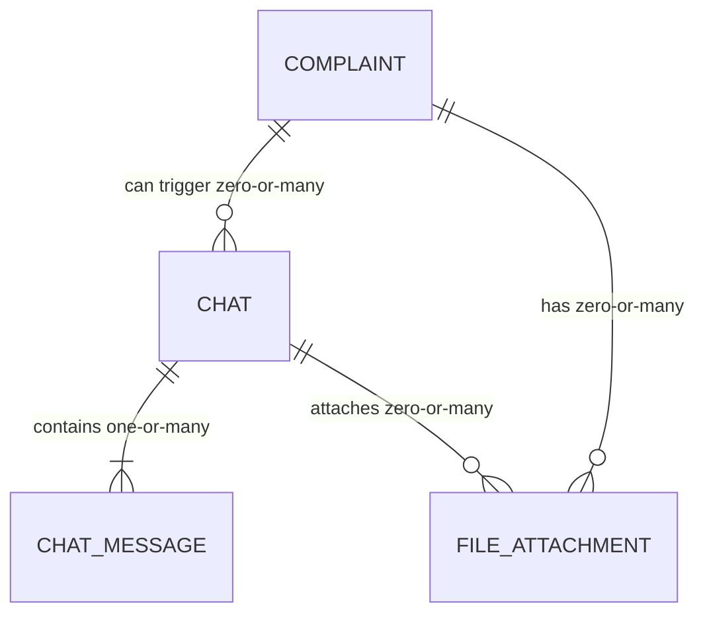
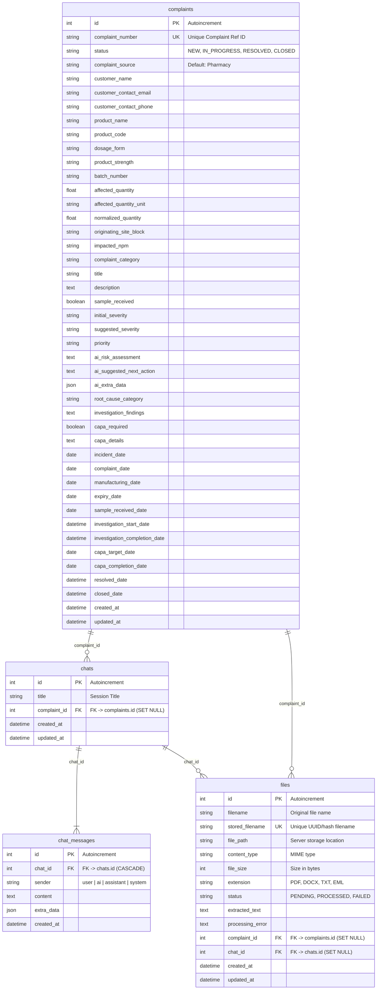

# Database Entity Relationship (ER) Diagrams

This document contains the complete **Mermaid ER Diagrams** for all database models in the CCMS application.

The models are defined in [`backend/app/models/`](backend/app/models):
- [`Complaint`](backend/app/models/complaint.py) (`complaints` table)
- [`Chat`](backend/app/models/chat.py) (`chats` table)
- [`ChatMessage`](backend/app/models/chat.py) (`chat_messages` table)
- [`FileAttachment`](backend/app/models/file.py) (`files` table)

---

## 1. High-Level Entity Relationships

---

## 2. Detailed Database ER Diagram

---

## 3. Relationships & Foreign Key Rules

| Source Entity | Target Entity | Foreign Key | Cardinality | On Delete Action |
| :--- | :--- | :--- | :--- | :--- |
| `complaints` | `chats` | `chats.complaint_id` | `1 : 0..N` | `SET NULL` |
| `chats` | `chat_messages` | `chat_messages.chat_id` | `1 : 1..N` | `CASCADE` |
| `complaints` | `files` | `files.complaint_id` | `1 : 0..N` | `SET NULL` |
| `chats` | `files` | `files.chat_id` | `1 : 0..N` | `SET NULL` |
