# End-to-End System Flowchart

This diagram illustrates the complete data processing flowchart of the **AI-Powered Customer Complaint Management System (CCMS)** from initial user input (raw text, email, or file upload) through LLM processing, quality scoring, frontend auto-population, quality assurance services, and database persistence.

---

## Complete Processing Flowchart

```mermaid
flowchart TD
    %% User Input Nodes
    subgraph INTAKE ["1. Intake & Input Ingestion"]
        A1[User Input] -->|Option A: Raw Text / Email| B1[Chat UI / Text Area]
        A1 -->|Option B: File Upload| B2[Document Uploader: PDF, DOCX, TXT, EML]
    end

    %% File Processing Pipeline
    subgraph FILE_PROC ["2. File Parsing & Ingestion"]
        B2 --> C1[POST /api/v1/files/upload]
        C1 --> C2[PDFLoader & Text Extractor]
        C2 --> C3[Save Metadata & Extracted Text to PostgreSQL 'files' Table]
        C3 --> C4[Pass Extracted Text to Chat Payload]
    end

    %% FastAPI API Gateway
    subgraph BACKEND ["3. Backend API Gateway"]
        B1 --> D1[POST /api/v1/chats]
        C4 --> D1
        D1 --> D2[Save User Message to 'chat_messages' Table]
        D2 --> D3[Invoke ComplaintStructuredParser]
    end

    %% LangGraph LLM Engine
    subgraph LANGGRAPH ["4. LangGraph StateGraph Extraction Workflow"]
        D3 --> E1[StateGraph Execution: extract_complaint_node]
        
        E1 --> F1{Groq LLM Configured & Online?}
        
        %% Path 1: Primary LLM JSON Parsing
        F1 -->|Yes| G1[Execute ChatPromptTemplate + PydanticOutputParser]
        G1 --> H1{JSON Parse Success?}
        
        %% Path 2: Secondary Structured Output Fallback
        H1 -->|No| G2[Fallback: llm_client.with_structured_output]
        G2 --> H2{Structured Output Success?}
        
        %% Path 3: Tertiary Regex / Keyword Fallback
        F1 -->|No| G3[Deterministic Fallback: Regex & Keyword Matcher]
        H1 -->|No| G3
        H2 -->|No| G3
        
        %% Output Aggregation
        H1 -->|Yes| I1[ComplaintExtractionOutput Pydantic Model]
        H2 -->|Yes| I1
        G3 --> I1
    end

    %% Quality Evaluation & Completeness Score
    subgraph EVALUATION ["5. Quality Evaluation & Completeness Scoring"]
        I1 --> J1[CompletenessService.evaluate]
        J1 --> J2[Calculate Completeness Score %]
        J2 --> J3[Identify Missing Critical & Important Fields]
        J3 --> J4[Generate Recommended QA Follow-up Email Draft]
        J4 --> J5[Save Assistant Reply to 'chat_messages' Table]
    end

    %% Frontend Auto-Population & Copilot
    subgraph FRONTEND ["6. Frontend Auto-Population & AI Copilot UI"]
        J5 --> K1[HTTP Response to React Frontend]
        K1 --> K2[Redux Store: complaintSlice & chatSlice Update]
        K2 --> K3[Auto-Populate Form Fields: Product, Batch, Dosage, Dates, Customer]
        K2 --> K4[Render AI Copilot Side Panel: Score Gauge, Risk Matrix, Email Draft]
    end

    %% Intelligence Services
    subgraph SERVICES ["7. QA Intelligence Services"]
        K3 --> L1[Ishikawa 5M+E Root Cause Analysis Service]
        K3 --> L2[CAPA & Multi-Dimensional Risk Recommendation Engine]
        K3 --> L3[Duplicate & Defect Cluster Detection Scanner]
    end

    %% Final Persistence
    subgraph PERSISTENCE ["8. Database Persistence"]
        L1 & L2 & L3 --> M1[QA Manager Submits Final Form]
        M1 --> M2[POST /api/v1/complaints]
        M2 --> M3[Persist Complaint Record in PostgreSQL 'complaints' Table]
        M3 --> M4[Link Optional chat_id & file_id]
    end
```

---

## Detailed Step Breakdown

| Phase | Component | Action / Description |
| :--- | :--- | :--- |
| **1. Ingestion** | Frontend | User enters text in the Chat interface or uploads a document (`PDF`, `DOCX`, `TXT`, `EML`). |
| **2. File Parsing** | `pdf_loader.py` | Extracts text content using `pypdf`, `pdfplumber`, or standard text parsers and stores metadata in PostgreSQL `files` table. |
| **3. API Gateway** | `routes/chat.py` | Receives text payload, records user message in `chat_messages` table, and passes request to LangGraph. |
| **4. LangGraph Engine** | `structure_output.py` | Executes `extract_complaint_node` over Groq (`gemma2-9b-it` / `llama-3.3-70b-versatile`). Features 3-tier fallback execution (JSON prompt -> Structured Output -> Regex Keyword Matcher). |
| **5. Completeness** | `services/completeness.py` | Computes completeness score (0–100%), flags missing regulatory fields, and drafts follow-up email. |
| **6. Frontend Sync** | Redux Toolkit | Auto-fills complaint intake form fields and renders real-time AI copilot recommendations. |
| **7. QA Services** | `services/` | Executes Root Cause Analysis (5M+E), Risk Evaluation (Hazard Class I–III), CAPA generation, and Duplicate Batch scanning. |
| **8. Persistence** | PostgreSQL | Saves validated complaint record to `complaints` table with foreign key linkage to `chats` and `files`. |

---

## Related Architecture Diagrams

- [System Architecture](SYSTEM_ARCHITECTURE.md)
- [LangGraph Extraction Workflow](LANGGRAPH_WORKFLOW.md)
- [Database ER Diagrams](../ER_DIAGRAM.md)
