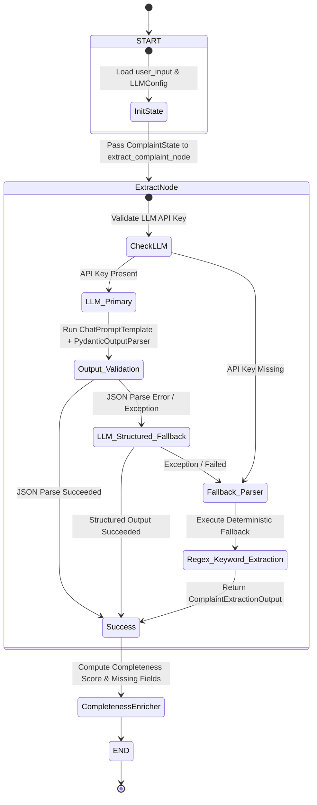
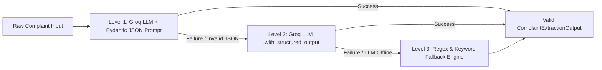

# LangGraph Agent Workflow & Fallback Chain

This document details the internal **LangGraph `StateGraph` workflow** responsible for structured complaint extraction, schema validation, and fallback handling.

---

## LangGraph State Machine Diagram



---

## State Definition (`ComplaintState`)

The state object maintained across node transitions:

```python
class ComplaintState(TypedDict):
    user_input: str
    llm_config: Optional[LLMConfig]
    extracted_output: Optional[ComplaintExtractionOutput]
    error: Optional[str]
```

---

## Resilience & Fallback Hierarchy



---

## Related Architecture Diagrams

- [End-to-End System Flowchart](FLOWCHART.md)
- [High-Level System Architecture](SYSTEM_ARCHITECTURE.md)
- [Database ER Diagrams](../ER_DIAGRAM.md)
