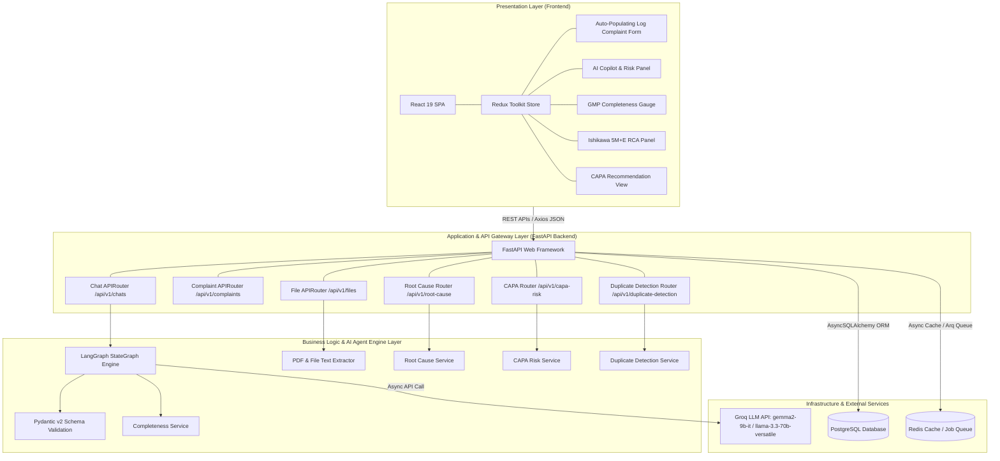

# High-Level System Architecture

This document describes the 3-tier system architecture of the **AI-Powered Customer Complaint Management System (CCMS)**.

---

## 3-Tier System Architecture Diagram

---

## Component Architecture Overview

### 1. Presentation Layer (Frontend)
- **Framework**: React 19 + Redux Toolkit
- **Components**:
  - **Complaint Intake Form**: Dynamic form for GMP defect reporting.
  - **AI Copilot Side Panel**: Live chat, risk matrices, and follow-up email drafts.
  - **Quality Score Gauge**: Visual completeness rating (0–100%).
  - **RCA & CAPA Components**: Ishikawa 5M+E breakdown and action plans.

### 2. Application Layer (Backend)
- **Framework**: FastAPI (Python 3.12, Uvicorn)
- **ORMs & Drivers**: AsyncSQLAlchemy + Asyncpg
- **Validation**: Pydantic v2 schemas for request/response typing.

### 3. AI & Agent Layer
- **Orchestration**: LangGraph (`StateGraph`) workflow.
- **LLM Engine**: Groq Cloud API featuring ultra-low latency inference with `gemma2-9b-it` and `llama-3.3-70b-versatile`.
- **Parsing Fallbacks**: 3-level resilience pipeline ensuring complete system operation even during API key absence or rate limits.

### 4. Persistence & Infrastructure Layer
- **Database**: PostgreSQL 15+ holding `complaints`, `chats`, `chat_messages`, and `files`.
- **Caching & Queues**: Redis 6+ for async background processing and session state.

---

## Related Architecture Diagrams

- [End-to-End System Flowchart](FLOWCHART.md)
- [LangGraph Extraction Workflow](LANGGRAPH_WORKFLOW.md)
- [Database ER Diagrams](../ER_DIAGRAM.md)
