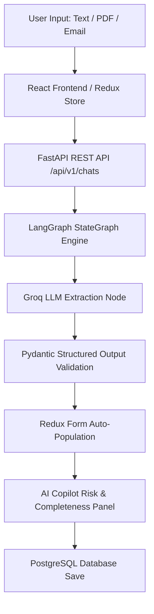
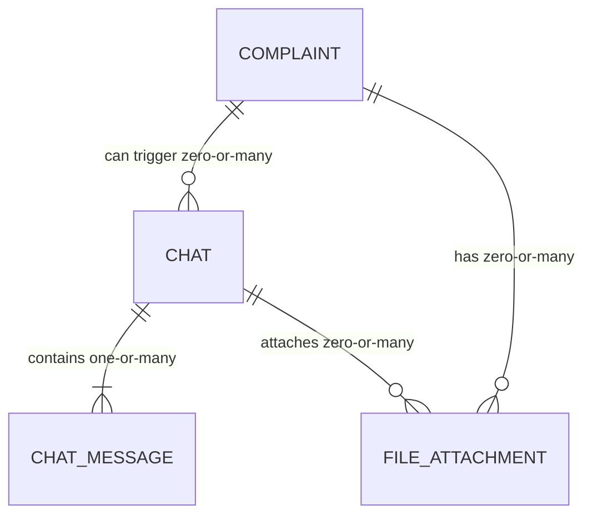

# AI-Powered Customer Complaint Management System (CCMS)
> **Pharmaceutical Manufacturing Quality Management System (QMS)**  

---

## Executive Summary

This repository contains an end-to-end **AI-Powered Customer Complaint Management System (CCMS)** tailored for pharmaceutical manufacturing (API & Finished Dosage Forms). It automates the intake, extraction, quality evaluation, root cause analysis, risk classification, and CAPA recommendations for customer defect reports using a **LangGraph** workflow powered by **Groq LLMs**.

---

## Key Features

* **Automated Complaint Intake & Extraction**: Parses unstructured customer complaints (plain text, emails, PDFs) into structured GMP data fields using **LangGraph** and **Groq (`gemma2-9b-it` / `llama-3.3-70b-versatile`)**.
* **Auto-Populating Log Complaint Form**: Automatically fills product names, batch numbers, dosage forms, complainant info, and defect categories into a responsive React UI.
* **AI Copilot & Multi-Dimensional Risk Matrix**: Provides live risk assessment (Hazard Class I–III, RPN matrix, initial severity rating) directly within an interactive side panel.
* **GMP Completeness Checker**: Evaluates complaint data completeness against regulatory standards, calculates a quality score, identifies missing fields, and generates automated follow-up email drafts.
* **AI Root Cause Analysis (Ishikawa 5M+E)**: Evaluates defect payloads using the 5M+E framework (Man, Machine, Material, Method, Measurement, Environment) to recommend root cause categories and QA investigation checklists.
* **Duplicate & Defect Cluster Detection**: Scans database records for matching batch numbers, similar descriptions, or recurring defect patterns to prevent duplicate entries and detect batch issue clusters.
* **CAPA Recommendation Engine**: Automatically generates immediate containment actions, corrective actions, and preventive action plans based on defect severity.

---

## Mandatory Tech Stack

| Layer | Technology | Purpose |
| :--- | :--- | :--- |
| **Frontend** | React 19, Redux Toolkit, Lucide Icons | Component-driven UI with centralized state management |
| **Backend** | Python 3.12, FastAPI, AsyncSQLAlchemy | High-performance asynchronous REST API |
| **AI Agent Framework** | LangGraph (`StateGraph`) | Orchestrates structured extraction workflows & node fallbacks |
| **LLMs** | Groq API (`gemma2-9b-it`, `llama-3.3-70b-versatile`) | Fast, high-precision structured JSON extraction |
| **Database** | PostgreSQL + Alembic Migrations | Relational persistence for complaints, chats, and attachments |
| **Caching** | Redis | Asynchronous job queuing and cache storage |
| **Typography** | Google Inter | Clean modern typography |

---

## Architecture & Data Flow

> 📘 **Detailed Architecture Specs**:
> - [End-to-End Processing Flowchart](./architecture/FLOWCHART.md)
> - [3-Tier System Architecture](./architecture/SYSTEM_ARCHITECTURE.md)
> - [LangGraph Extraction & Fallback Chain](./architecture/LANGGRAPH_WORKFLOW.md)
> - [Database ER Diagrams](./ER_DIAGRAM.md)



---

## Database ER Diagram

> For the full attribute breakdown, keys, and foreign key rules, see [ER_DIAGRAM.md](./ER_DIAGRAM.md).



---

## Repository Structure

```
CCMS/
├── backend/
│   ├── app/
│   │   ├── config/          # Database, Redis, and Groq LLM configurations
│   │   ├── exceptions/      # Domain-specific HTTP exceptions
│   │   ├── jobs/            # Background worker tasks (Arq / Redis)
│   │   ├── models/          # SQLAlchemy async ORM models (Complaint, Chat, File)
│   │   ├── prompts/         # Structured extraction system & user prompts
│   │   ├── repositories/    # Database access repositories
│   │   ├── routes/          # FastAPI APIRouter endpoints (complaint, chat, file)
│   │   ├── schemas/         # Pydantic v2 schemas for request/response validation
│   │   ├── services/        # Business logic services (RCA, CAPA, Completeness, Duplicates)
│   │   └── utils/           # LangGraph StateGraph pipeline & PDF loader
│   ├── alembic/             # Database migration scripts
│   ├── tests/               # Unit and integration test suite (Pytest)
│   ├── main.py              # FastAPI application entry point
│   ├── Dockerfile           # Backend container definition
│   └── requirements.txt     # Python dependencies
├── frontend/
│   ├── src/
│   │   ├── api/             # Axios API service endpoints
│   │   ├── components/      # React UI components (Form, Copilot, RCA, CAPA, Duplicates)
│   │   ├── store/           # Redux Toolkit slices (complaint, chat)
│   │   ├── App.jsx          # Main application layout
│   │   └── main.jsx         # React DOM root with Redux Provider
│   └── package.json         # Frontend dependencies and scripts
└── docker-compose.yaml      # Multi-container orchestration (Redis / Postgres)
```

---

## Getting Started

### Prerequisites

* **Python**: 3.10+
* **Node.js**: 18+
* **PostgreSQL**: 15+ (or Docker)
* **Redis**: 6+ (or Docker)
* **Groq API Key**: Obtain from [Groq Console](https://console.groq.com/docs/models)

---

### Step 1: Environment Configuration

Create a `.env` file in `backend/`:

```env
POSTGRE_USER=postgres
POSTGRE_PASSWORD=your_password
POSTGRE_DB=ccms
POSTGRE_HOST=localhost
POSTGRE_PORT=5432

REDIS_HOST=localhost
REDIS_PORT=6379
REDIS_URL=redis://localhost:6379

GROQ_API_KEY=gsk_your_groq_api_token_here
LLM_MODEL=gemma2-9b-it
```

---

### Step 2: Backend Setup

```bash
# 1. Navigate to backend directory
cd backend

# 2. Create and activate virtual environment
python -m venv .venv
# On Windows:
.venv\Scripts\activate
# On macOS/Linux:
source .venv/bin/activate

# 3. Install dependencies
pip install -r requirements.txt

# 4. Apply database migrations
alembic upgrade head

# 5. Start FastAPI dev server
uvicorn main:app --reload --port 8000
```
> The interactive API documentation will be available at `http://localhost:8000/docs`.

---

### Step 3: Frontend Setup

```bash
# 1. Navigate to frontend directory
cd frontend

# 2. Install Node dependencies
npm install

# 3. Start Vite development server
npm run dev
```
> Access the React UI in your browser at `http://localhost:5173`.

---

## Verification & Testing

The backend includes a comprehensive unit and integration test suite covering chat endpoints, complaint persistence, LangGraph extraction, and AI analysis modules:

```bash
cd backend
.venv\Scripts\pytest
```

---